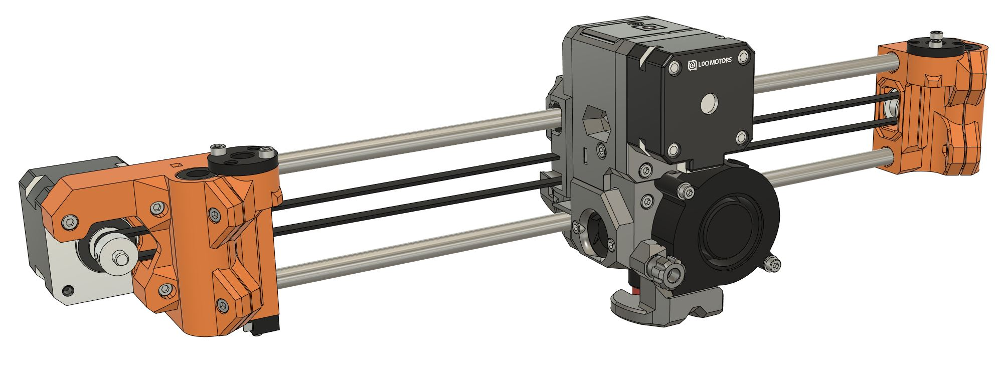

# BearExxa V2

## Table of contents
  1. [Introduction](#introduction)
  1. [Features](#features)
  1. [Disclaimer](#disclaimer)
  1. [Project Status](#project-status)
  1. [How To](#how-to)
  1. [Compatibility](#compatibility)
  1. [Bill Of Materials](#bill-of-materials)
  1. [Download](#download)
  1. [Print Settings](#print-settings)
  1. [Assembly Guide](#assembly-guide)
  1. [Configuration](#configuration)
  1. [Optional Parts](#optional-parts)
  1. [Official Kit](#official-kit)
  1. [Community](#community)
  1. [Support My Work](#support-my-work)
  1. [Credits And Thank you](#credits-and-thank-you)
  1. [License](#license)

## Introduction 

This is the repository for the Bear EXtruder and X Axis version 2 (BearExxa V2). It improves Prusa MK2.5(S, S+) and MK3(S, S+) print quality, speed, reliability and serviceability. It's the [BearExxa V1](https://github.com/gregsaun/bear_extruder_and_x_axis) successor.

## Features

  - Compatible with stock Prusa MK2.5(S, S+) and MK3(S, S+) hardware as well as Bear frame
  - High print quality by solving both repetitive and random extrusion artifacts
  - High torque and cold extruder motor for the best reliability and print quality in all conditions
  - Light print head without compromising features
  - Short filament path
  - Built-in filament sensor
  - Very concentric extruder gearing
  - Stiffer X axis
  - Efficient belt tensioning system
  - E3D Revo hotend with quick swap nozzles
  - Support multicolour printing (MMU or ERCF)
  - Quick and easy to service
  - Optimized for high reliability
  - Improved cable management
  - Special attention to safety with CE compliant hardware and careful testing
  - No special tools, no crimping, no soldering and no difficult adjustments required during the assembly
  - Detailed assembly guides and documentation
  - Fully open source
 
:arrow_right: [Read our detailed Design Goals](doc/design_goals.md) to understand how we engineered those features.

## Disclaimer

This project is only to provide an alternative extruder and X axis to your Prusa printers. We are not related to Prusa Research. We cannot be taken responsible for any damages you may do by using this project nor any decision Prusa would take on you (e.g.: loosing warranty). This project is at your own risk.

## Project Status

Status: Currently building the repository for the Beta release

This project is on hold for now. It's provided "as is" for any adventurous users interested in having a good extruder for their Prusa or Bear. The beta version of the BearExxa V2 provided here is fully functional and safe to use. The end goal is to provide a kit with all the parts and an improved stepper and hardware for better print quality and reliability (read our [Design Goals](doc/design_goals.md)).

## How To

How to print, build and start using the BearExxa V2:

1. Read the [Project Status](#project-status), [Disclaimer](#disclaimer) and [Compatibility](#compatibility) to make sure you agree to the limitations
2. Buy the official BearExxa v2 kit or gather the parts using the [BOM](#bill-of-materials)
3. Buy the filament according to the [Print Settings](#print-settings)
4. [Download](#download) the BearExxa V2 printed parts and documentation
5. Calibrate your filaments with our [Calibration Guide](https://guides.bear-lab.com/Guide/Extrusion+multiplier+and+filament+diameter/8)
6. Slice and print the parts according to the [Print Settings](#print-settings)
7. Follow the [Assembly Guide](#assembly-guide)
8. Enjoy your new extruder :)

## Compatibility

The BearExxa V2 is compatible with both Prusa MK2.5(S, S+) and MK3(S, S+). The original and Bear frames are both supported. The stock firmware can be used except for the initial calibration (self tests) for which we provide our own firmware.

:arrow_right: [Read all the compatibilities in details here](doc/compatibility.md)

## Bill Of Materials

The BOM includes the list of printed parts and hardware needed.

:arrow_right: [Read the BOM here](doc/bom.md)

## Download

Click here to download the recommended version (v2.0.0-beta.6):

## Print Settings

> [!WARNING]
> Follow the recommended print settings and [**calibrate your extrusion multiplier**](https://guides.bear-lab.com/Guide/Extrusion+multiplier+and+filament+diameter/8) before printing the parts.

:arrow_right: [Read the print settings here](doc/print_settings.md)

## Assembly Guide

For the current beta version we only provide a quick assembly guide.

:arrow_right: [Read the quick assembly guide here](doc/quick_assembly_guide/README.md)

## Configuration

Configurations needed for steppers and extruder values.

> [!NOTE]
> The configuration for the Original Prusa MK2.5(S, S+) and MK3(S, S+) is covered in the assembly guide.

➡️ [Find the configuration here](doc/config)

## Optional Parts

### Official optional parts

  - Multicolour with MMU or ERCF: [optional_parts/mmu_ercf](optional_parts/mmu_ercf)
  - Reverse Bowden: [optional_parts/reverse_bowden](optional_parts/reverse_bowden)
  - X-end tensioner for E3D toothed idler: [optional_parts/x_end_idler_tensioner_e3d](optional_parts/x_end_idler_tensioner_e3d)

Click here to download all optional parts (v2.0.0-beta.6):

### Community's optional parts

Find optional parts designed by the community at [guides.bear-lab.com/Wiki/community_optional_parts](https://guides.bear-lab.com/Wiki/community_optional_parts).

## Official Kit

> [!NOTE]
> The official kit is not yet available. Will be sold for the first RC release.

### What's included
  - Custom extruder motor by LDO Motors (read the [Design Goals](doc/design_goals.md) for more information)
  - Hotend fan with tachometer wire to pass Prusa firmware self tests and have extra safety
  - Quality toothed idler with dual bearings and correctly sized flanges
  - Wires and textile sleeve for a clean wiring
  - Bondtech hardware
  - All the necessary small hardware (screws, nuts, dowel pins, PTFE tube, etc.)

### What's not included
As the kit is dedicated to Original Prusa printers the kit doesn't include:
  - Z axis Lead screw nuts
  - X axis smooth rods
  - X and Z axis linear bearings
  - X axis motor
  - Filament sensor PCB, ball and magnets
  - SuperPinda (or Pinda v2)

To allow flexibility on the hotend side the kit doesn't include:
  - E3D Revo Micro heatsink
  - E3D Revo HeaterCore
  - E3D Revo nozzle

## Community

* Discord server "The 602 Wasteland": [discordapp.com/invite/hYUjSnW](https://discordapp.com/invite/hYUjSnW)
* Bluesky: [@gregsaunier.bsky.social](https://bsky.app/profile/gregsaunier.bsky.social)
* Mastodon: [fosstodon.org/@bear_lab](https://fosstodon.org/@bear_lab)
* GitHub: [github.com/gregsaun](https://github.com/gregsaun)
* Twitter / X: [@gregoiresaunier](https://x.com/gregoiresaunier)

Do not hesitate to ask if you have a question.

## Support My Work

The bear project is made possible thanks to its supporters. You can help via
* Patreon: [patreon.com/gregsaun](https://www.patreon.com/gregsaun)
* PayPal: [paypal.me/gregsaun](https://www.paypal.me/gregsaun)
* GitHub Sponsor: [github.com/sponsors/gregsaun](https://github.com/sponsors/gregsaun)

Massive thank you in advance :heart:

## Credits And Thank You

- The close help of Florian Däubler, [Paul_GD](https://github.com/PaulGD03), [Schaun Doe](https://www.printables.com/@ShaunDoe), Sleene and  [vertigo235](https://www.printables.com/@vertigo235_33)
- All [my Patreons](https://www.patreon.com/gregsaun), it would have been impossible without their help
- [LDO Motors](https://ldomotors.com) for their continuous and precious support and sponsoring. LDO will manufacture the official kit for the final release with a custom stepper
- [E3D Online](https://e3d-online.com) for providing free hotends for development
- [Bondtech](https://www.bondtech.se) for providing free IDGA gears for development
- The [fan duct knob](https://www.printables.com/model/113157-bear-extruder-v1-fan-duct-knob) by Amelia Marie Collins
- [René Jurack](https://rene-jurack.de) for helping me on CFD simulation for the nozzle fan duct
- The 602 Wasteland Discord community for their precious knowledge, advice and great talks
- Keith Bennett for making the [Prusa AIO firmware](https://github.com/thisiskeithb/PrusaAIO) compatible
- [PoiTEE](https://x.com/PoiTEE) for the great talks and testing
- [FilamentFrenzy](https://x.com/FilamentFrenzy) for having tested and make noise for an early version
- Prusa Research for their MK2.5S and MK3S designs
- Adrian Bowyer for inventing [RepRap](https://reprap.org)

Thank you everyone ❤️

## License

The Bear EXtruder and X Axis v2 (BearExxa V2) is an open-source hardware project created from scratch by Grégoire Saunier with help and inspiration from the people and companies listed under "Credits and Thank You" as well as contributions linked to this repository.

All texts, images, PDF files and animations in this repository are licensed under the terms of the CC-BY-SA 4.0 license. The full license text of CC-BY-SA 4.0 is available in this repository at [`./LICENSE-CC-BY-SA-4.0`](./LICENSE-CC-BY-SA-4.0). Read more about this license [here](https://creativecommons.org/licenses/by-sa/4.0/).

All gcode files in this repository are licensed under the terms of the MIT license. The full license text of MIT is available in this repository at [`./LICENSE-MIT`](./LICENSE-MIT). Read more about this license [here](https://opensource.org/license/MIT).

All content in this repository, except for texts, images, PDF files, animations and gcode files is licensed under the terms of the CERN-OHL-P v2 license. The full license text of CERN-OHL-P v2 is available in this repository at [`./LICENSE`](./LICENSE). Read more about this license [here](https://cern-ohl.web.cern.ch/).
