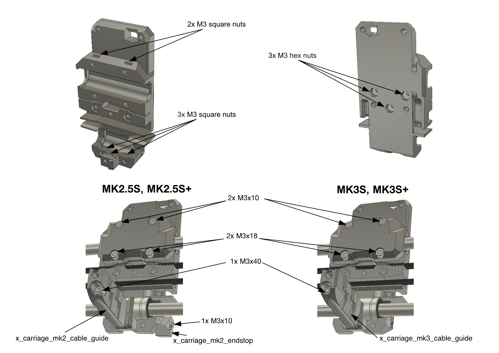
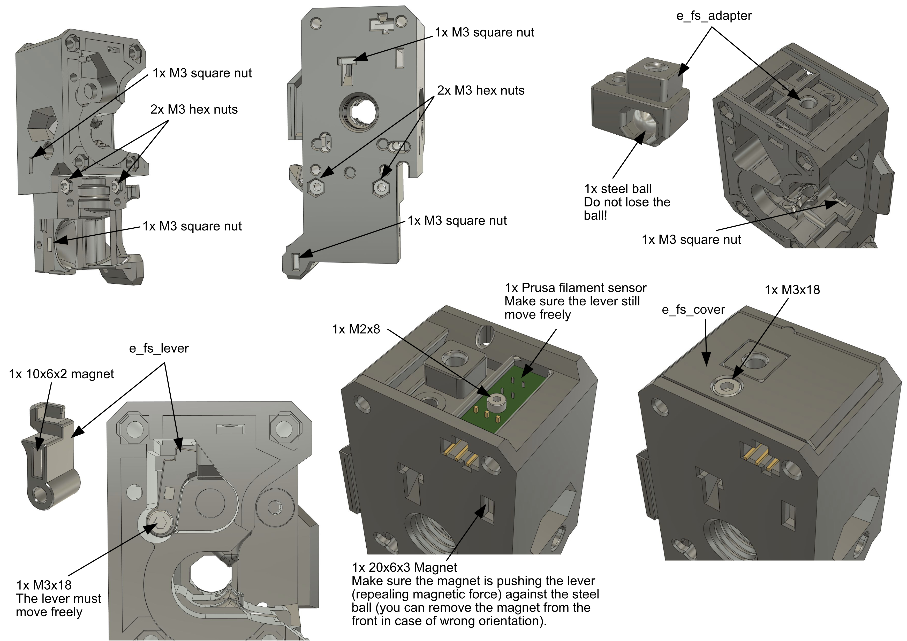
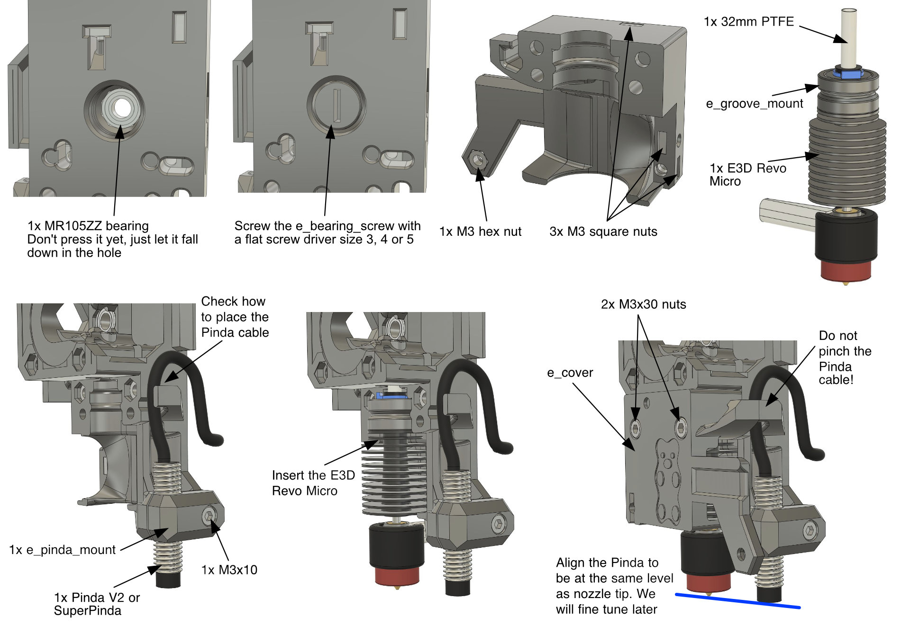
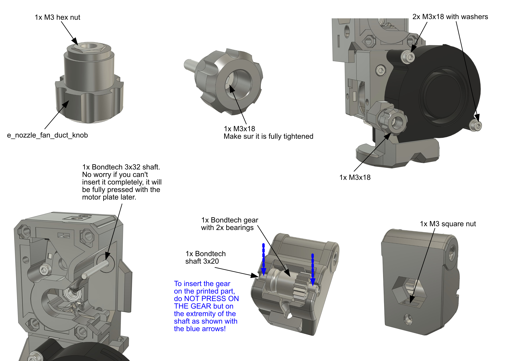
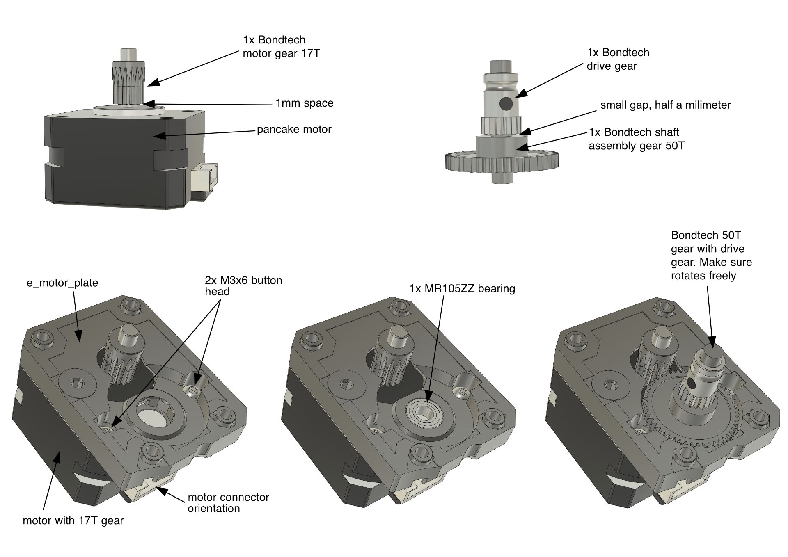
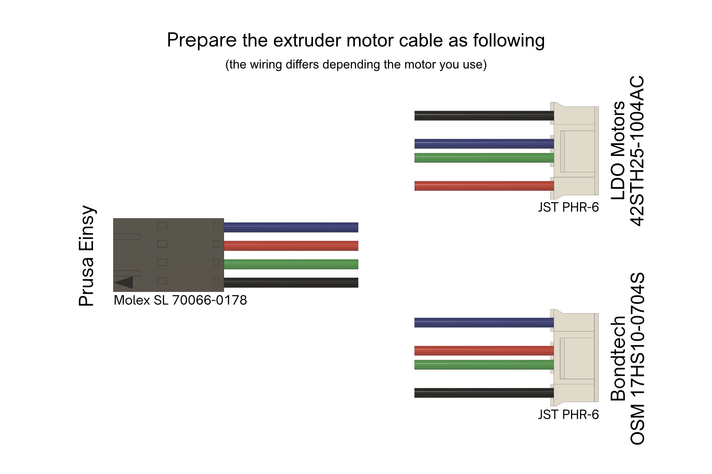
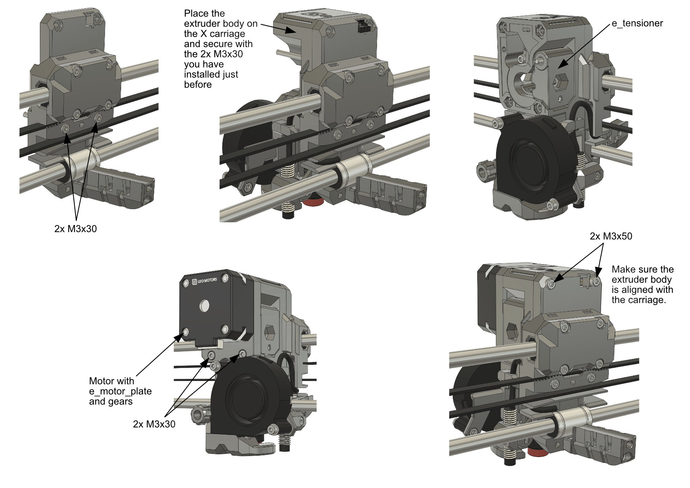
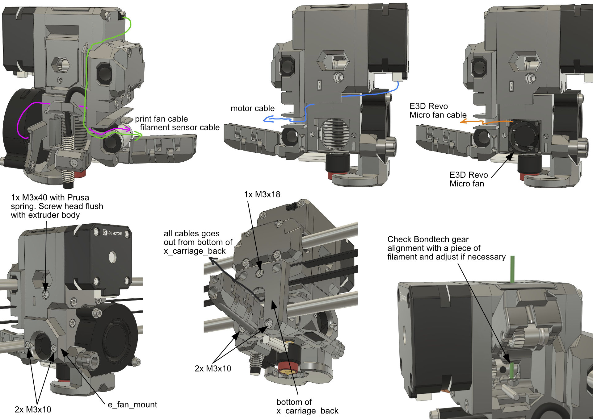

# BearExxa V2

## Quick Assembly Guide

This guide is only for the beta version. It's provided at your own risk.

> [!TIP]
> Images are clickable for larger view.

### Part 1
  1. Read the [Project Status](/README.md#project-status), [Disclaimer](/README.md#disclaimer) and [Compatibility](/README.md#compatibility) to make sure you agree to the limitations
  2. Get the filament according to the [Print Settings](/README.md#print-settings)
  3. [Download](/README.md#download) the BearExxa V2 files
  4. Calibrate your filaments with our [Calibration Guide](https://guides.bear-lab.com/Guide/Extrusion+multiplier+and+filament+diameter/8)
  5. Slice and print the parts according to the [Print Settings](/README.md#print-settings)

### Part 2
Start by doing the preflight check and disassembly :
  1. With a web browser, go to [https://guides.bear-lab.com -> Extruder and X Axis -> Bear Extruder -> Assembly guide -> 1. Preflight check and disassembly](https://guides.bear-lab.com/Guide/1.+Preflight+check+and+disassembly/34?lang=en)
  2. Follow steps 1 and 2
  3. At step 3, use the printed file *tool_ptfe_cutter_32mm* that comes with BearExxa V2 to cut the PTFE. You only need to make an internal chamfer. The end of the tube that goes in the hotend needs to be cut straight (no external chamfer)
  4. Follow steps 4 to 9

### Part 3
Then Assemble the X Axis :
  1. With a web browser, go to [https://guides.bear-lab.com -> Extruder and X Axis -> Bear Extruder -> Assembly guide -> 2. X Axis](https://guides.bear-lab.com/Guide/2.+X+axis/39?lang=en)
  1. Follow all steps from 1 to 15

### Part 4

### Part 5

### Part 6

### Part 7

### Part 8

### Part 9

### Part 10

### Part 11

### Part 12
Finally, follow our guide "Final adjustments and calibration" like this:
  1. With a web browser, go to [https://guides.bear-lab.com -> Extruder and X Axis -> Bear Extruder> Assembly guide -> 5. Final adjustments and calibration](https://guides.bear-lab.com/Guide/5.+Final+adjustments+and+calibration/38?lang=en)
  1. Follow steps 1 to 12

### Part 13
We now need to configure extruder steps per millimeters to 415 and microstepping to 1/16. You can do this with the provided gcode file :
  1. In the downloaded BearExxa v2 files, go to [config/firmware/prusa_original/config_prusa/](/doc/config/firmware/prusa_original/) 
  1. Copy `bearexxa2_config.gcode` to an SD card
  1. Insert the SD card in your printer and print to `bearexxa2_config.gcode` file
  1. You can now remove the SD card and delete the file

### Part 14
The current E3D Micro hotend fan does not have a tachometer wire so we need to deactivate the fan check:
  1. In the LCD menu, go to `Settings -> Fans Check`
  1. Select `OFF`

> [!TIP]
> The official kit will contains a fan with the tachometer wire and you will not needed to disable this features anymore. 

### Part 15
  1. Temporarily plug the original Prusa hotend fan 40x40 (Noctua or Delta):  
    - [MK3(S, S+) guide](https://help.prusa3d.com/guide/8-electronics-assembly_174100#175539)
    - [MK2.5(S, S+) guide](https://help.prusa3d.com/guide/4-electronics-assembly_62856#62944)
  3. Run the self tests using `LCD Menu -> Calibration -> Selftest`
  4. Once the fan detection is done, plug back the E3D Revo Micro fan
  5. Follow steps 14 to 16

> [!WARNING]
> Any issues reported during the self test must be fixed before continuing further.

### Part 16 (Optional)
This step is optional. It explains how to use the latest Prusa firmware but it's not a necessity nor safer. You can use the Bear calibration firmware to print as a normal Prusa firmware.

First we need to flash the latest Prusa firmware:
  1. Download the [latest Prusa firmware](https://github.com/prusa3d/Prusa-Firmware/releases/latest). You do not need to download the special E3D Revo firmware version 
  2. With a web browser, go to [https://guides.bear-lab.com -> Extruder and X Axis -> Bear Extruder> Assembly guide -> 5. Final adjustments and calibration](https://guides.bear-lab.com/Guide/5.+Final+adjustments+and+calibration/38?lang=en)
  3. Follow step 10 to 12  to flash the latest Prusa firmware (instead of Bear calibration firmware)
  
Then we need to set the hotend fan to always run at 100% speed and disable fan check:
  1. In the LCD menu go to `Settings -> HW Setup`, then scroll to any menu item and hold the knob for 3 seconds until you hear a "click"
  2. Scroll again the same menu and you should now see a new `Experimental` option in the bottom
  3. Enter in this `Experimental` menu and then set `ALTFAN det.` to `OFF`
  4. Go back to the main LCD menu and `Settings -> Fans Check` and select `OFF`
  
Finally we need to disable the new "Thermal Model" for the hotend to rollback to standard PID method used up to Prusa firmware 3.11.x:
  1. Using [Octoprint](https://help.prusa3d.com/article/crash-dump_364959#octoprint) or [PuTTy](https://help.prusa3d.com/article/crash-dump_364959#putty), send the following commands:  
  `M310 S0`  
  `M500`  
  2. In `LCD Menu -> Settings -> Temperature -> Fan speed` set the value at 130 if you print lots of PETG and 255 if you print lots of PLA. For other materials select a value suitable for your most used filament
  3. Run the hotend PID calibration with the `LCD Menu -> Calibration -> PID calibration` for a temperature that matches your most used printing temperature
  4. Once finished, shutdown the printer

> [!TIP]
> You can find more information on the Prusa website about the [experimental menu here](https://help.prusa3d.com/article/experimental-menu-mk3-s-_161213) and the new  ["Thermal Model" here](https://help.prusa3d.com/article/thermal-model-calibration_382488).

### Part 17
All done, enjoy the new extruder and X axis :)
