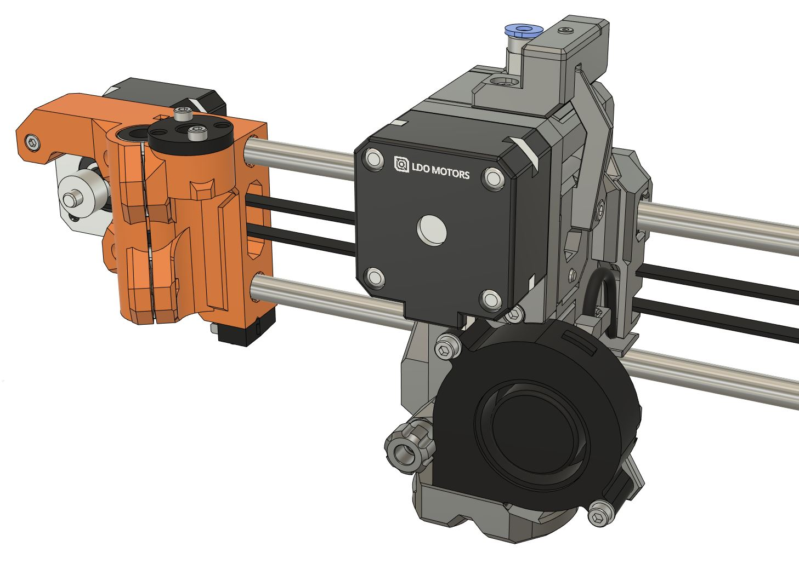
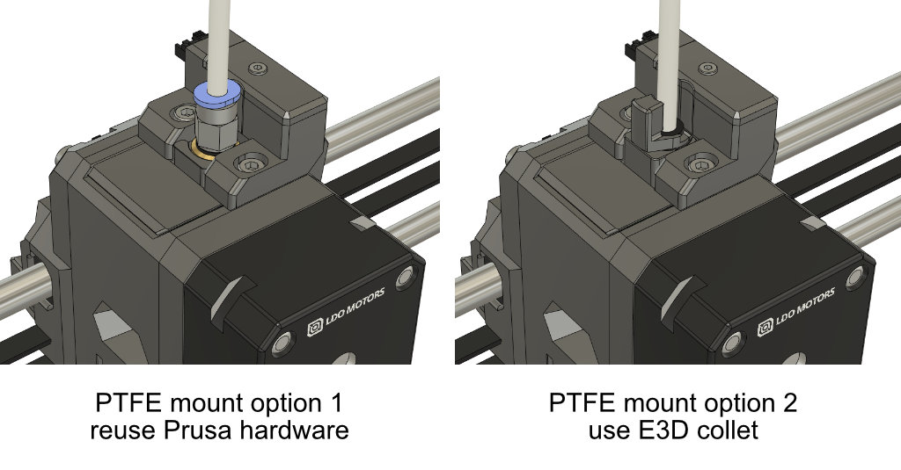

# BearExxa V2

## MMU ERCF adapter

### Introduction

To make your BearExxa V2 capable of printing in multicolour with Prusa MMU or [ERCF by EtteGit](https://github.com/EtteGit/EnragedRabbitProject).

The PTFE mount on the extruder is available in two options:
  - Reuse the Prusa hardware (brass insert and Festo coupling). Note that the brass insert is easy to remove in general
  - Use the E3D collet system for a lighter and the PTFE pass through system

### Bill of Materials

| Part                               | Quantity | Comment | Link |
|------------------------------------|:--------:|---------|------|
| Prusa MMU or ERCF unit             |     1    |         |      |
| M2x8 (ISO 4762)                    |     1    |         |      |
| M3x10 (ISO 4762)                   |     1    |         |      |
| M3x14 (ISO 4762)                   |     1    |         |      |
| M3x18 (ISO 4762)                   |     1    |         |      |
| M3 square nut (DIN 562)            |     1    |         |      |
| M3 hex nut (ISO 4032)              |     1    |         |      |
| E3D bowden collet for metal 1.75mm |     1    | Only for PTFE mount option 2 | [E3D link](https://e3d-online.com/products/embedded-bowden-coupling-for-metal) or [Prusa link](https://www.prusa3d.com/product/heatsink-collet/) |
| Prusa filament sensor              |     1    | Comes with your Prusa MK3S (or S+) printer | [Prusa link](https://www.prusa3d.com/product/ir-filament-sensor/) |
| Prusa filament cable               |     1    | Comes with your Prusa MK3S (or S+) printer | [Prusa link](https://www.prusa3d.com/product/filament-sensor-einsy-cable/) |
| Prusa 10x6x2 magnet                |     1    | Comes with your Prusa MK3S (or S+) printer | [Prusa link](https://www.prusa3d.com/product/set-of-magnets-mk2-5s-mk3-s/) |
| Prusa 20x6x2 magnet                |     1    | Comes with your Prusa MK3S (or S+) printer | [Prusa link](https://www.prusa3d.com/product/set-of-magnets-mk2-5s-mk3-s/) |
| Prusa 7mm steel ball               |     1    | Comes with your Prusa MK3S (or S+) printer |  |

### Printed parts

Download all optional parts with the button at [Repo Homepage -> Optional Printed Parts -> Official printed parts](/README.md#official-optional-parts)

### Print settings

> [!WARNING]
> The parts have been designed and tested with the parameters below and it is important to follow them to avoid issues like part cracking, bad bridging, not enough stiffness or wrong tolerances. You must [**calibrate your extrusion multiplier**](https://guides.bear-lab.com/Guide/Extrusion+multiplier+and+filament+diameter/8?lang=en) before printing the parts.

You can use the default PrusaSlicer print profile *0.20mm QUALITY @MK3* with 4 perimeters and 5 tops/bottoms layers and 20% infill. Otherwise, here are the parameters we recommend:

  * Slicer : PrusaSlicer
  * Nozzle size : 0.4mm
  * Layer height : 0.2mm
  * Infill : 20% Cubic or 20% Gyroid
  * Number of perimeters : 4
  * Number of top/bottom layers : 5
  * Default extrusion width : 0.45mm
  * Perimeters width : 0.45mm
  * External perimeters width : 0.45mm
  * Support : No
  * Brim : No
  * Detect thin walls : No

### Filament type

The parts are designed for PETG and this is what we recommend. Please consider recycled filament and cardboard spool or masterspool. If you are using a different filament material you will need to account for the shrinkage in XY plane directly in the slicer.

| Part                         | Quantity |    Filament    |  Color  | Comment                 |
|------------------------------|:--------:|:--------------:|:-------:|-------------------------|
| e_fs_adapter_mmu2s_prusa     |     1    |      PETG      |  Any    | For PTFE mount option 1 |
| e_fs_adapter_mmu2s_e3d       |     1    |      PETG      |  Any    | For PTFE mount option 2 |
| e_fs_adapter_mmu2s_e3d_clip. |     1    |      PETG      |  Any    | For PTFE mount option 2 |
| e_fs_chimney_cover_mmu2s     |     1    |      PETG      |  Black  |                         |
| e_fs_chimney_mmu2s           |     1    |      PETG      |  Black  |                         |
| e_fs_cover_mmu2s             |     1    |      PETG      |  Any    |                         |
| e_fs_lever_mmu2s             |     1    |      PETG      |  Black  |                         |
| e_tensioner_mmu2s            |     1    |      PETG      |  Any    |                         |

Note 1: Avoid eSUN PETG as some user reported that it might not block IR signal correctly. No other PETG have been reported to have this issue yet.

### Assembly

Read the [assembly guide here](assembly_guide/mmu_assembly_guide.pdf)

### CAD Files

The native CAD (Fusion) and STEP files are available at [`/cad/optional_parts`](/cad/optional_parts)