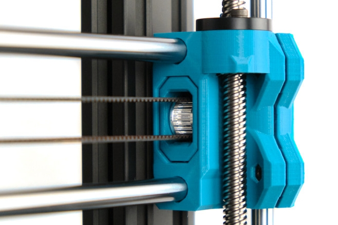

# BearExxa V2

## X-end idler tensioner for E3D toothed idler

### Introduction

This is a X end idler tensioner compatible with E3D toothed idler.

### Bill of materials

| Part                         | Quantity | Comment/Link                                |
|------------------------------|:--------:|---------------------------------------------|
| Bear X axis                  |     1    | From version 0.6.0-a and greater            |
| E3D Gates 2GT Toothed Idler, 6mm Belt, 20 Tooth, 5mm ID |     1    | [E3D ljnk](https://e3d-online.com/products/gates-belts-pulleys-and-idlers) |
| Dowel pin, dia: 4.95mm (+0.00/-0.05), length: 15.8mm (+0.00/-0.05) |     1    | Must fit the 2GT idler bearing. :pushpin: Cut a M5 screw if you can't find one |
| M3 Hex nylock nuts (DIN 985) |     2    | Same as original Bear X end idler tensioner |

### Printed parts

Download all optional parts with the button at [Repo Homepage -> Optional Printed Parts -> Official printed parts](/README.md
#official-optional-parts)

### Print settings

> [!WARNING]
> The parts have been designed and tested with the parameters below and it is important to follow them to avoid issues like part cracking, bad bridging, not enough stiffness or wrong tolerances. You must [**calibrate your extrusion multiplier**](https://guides.bear-lab.com/Guide/Extrusion+multiplier+and+filament+diameter/8?lang=en) before printing the parts.

You can use the default PrusaSlicer print profile *0.20mm QUALITY @MK3* with 4 perimeters and 5 tops/bottoms layers and 20% infill. Otherwise, here are the parameters we recommend:

  * Slicer : PrusaSlicer
  * Nozzle size : 0.4mm
  * Layer height : 0.2mm
  * Infill : 20% Cubic or 20% Gyroid
  * Number of perimeters : 4
  * Number of top/bottom layers : 5
  * Default extrusion width : 0.45mm
  * Perimeters width : 0.45mm
  * External perimeters width : 0.45mm
  * Support : No
  * Brim : No
  * Detect thin walls : No

### Filament type

The parts are designed for PETG and this is what we recommend. Please consider recycled filament and cardboard spool or masterspool. If you are using a different filament material you will need to account for the shrinkage in XY plane directly in the slicer.

| Part                       | Quantity |    Filament    | Color | Comment                     |
|----------------------------|:--------:|:--------------:|:-----:|-----------------------------|
| x_end_idler_tensioner_e3d  |     1    |      PETG      |  Any  |                             |

### Credits

Thanks to Matthew Humphrey for having created the first version of this idler.
[thingiverse.com/thing:3308226](https://www.thingiverse.com/thing:3308226)

What has changed from Matthew's design:
  * Improves shape and tolerances around the E3D idler
  * Derivation from the original design (using Fusion derive feature)

### CAD Files

This is the exact same design than the on the BearExxa V1 and the CAD files are available on the [BearExxa V1 GitHub1 repository](https://github.com/gregsaun/bear_extruder_and_x_axis).